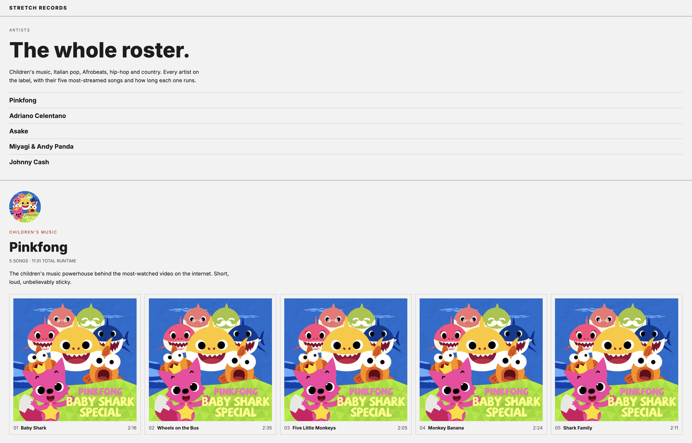
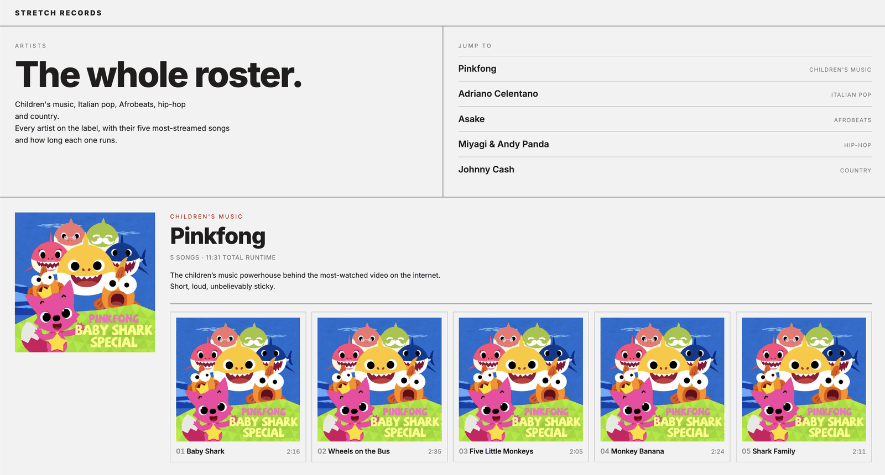

# Stretch Records

The starter repository for the Web Foundations stretch project: a site for **Stretch Records**, a small label with a gloriously mixed roster of five artists, from Baby Shark to Johnny Cash.

## What is in this repository

- `index.html`, empty on purpose. Every line of the page is yours to write.
- `css/`, the folder for your stylesheet.
- `images/`, the five artist photos and nine cover files, already compressed to the shipping spec: at most 800px on the long edge, JPEG quality around 60. Open the folder and read the file sizes once; kilobytes, not megabytes, is what shipping-ready looks like.
- `artist-dataset.md`, the source of truth for every artist, song, duration, genre, blurb, and cover assignment. Read it end to end before you build, and type the names and numbers exactly as it states them.

## How to make it yours

This repository is a starting point, not a place to work. Clone it, then make it your own:

1. Clone this repository over SSH.
2. Delete the hidden `.git` folder inside the clone, then run `git init`.
3. Create a new empty public repository named `stretch-records` on your own GitHub, connect it as the remote over SSH, and push. That push is your first commit on `main`.
4. Enable GitHub Pages on `main`, create the `development` branch from `main`, and push it. From here on, nothing lands on `main` except release PRs.

## The expected result

Two reference builds answer this same brief. The beginner build is the target for this project:

The advanced build shows the same page with professional tooling, as reading for the curious:

## The brief

You will build one Artists page that presents all five artists with their songs and durations, plus a newsletter signup form, and ship it through the development branch model to your own GitHub Pages address. The full brief, the video tours of the expected results, and the grading rubric are all in the course.

Good luck, and enjoy the roster.
